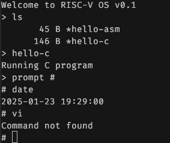

# riscv-os
An attempt to create a tiny OS for 32-bit RISC-V implemented entirely in assembly
(the C files you find in the repo are tests only).

Currently, the OS runs on [virt](https://www.qemu.org/docs/master/system/riscv/virt.html)
and [SiFive](https://www.qemu.org/docs/master/system/riscv/sifive_u.html)
machines under QEMU.
It uses very minimalistic configuration of hardware: 4MB of RAM and 1 core.
It's also minimalistic in terms of RISC-V instruction set, as it only utilizes the E, M
and Zicsr extensions.

## Features



The RISC-V OS is in very early stage of development, and currently conceptually is closer to C64's
[Kernal](https://en.wikipedia.org/wiki/KERNAL) rather than
Linux or any RTOS.

### Implemented features

- framebuffer (40x25 characters text screen, configurable),
- trivial [shell](https://github.com/ddrcode/riscv-os/wiki/Shell-commands)
- drivers for UART, RTC and PLIC
- driver/hardware abstraction layer (HAL)
- keyboard input (UART, interrupts)
- [system functions](https://github.com/ddrcode/riscv-os/wiki/System-functions) callable via `ecall`
- interrupt/exception handlers
- User Mode (for running shell) and Machine Mode (for the system)
- various math and string functions
- fallbacks for missing M-extension
- trivial, read-only file system
- external [programs](https://github.com/ddrcode/riscv-os-apps) (implemented in Assembly, C and Rust), loadable to the system

### Planned features

- system events
- supervisor mode (currently everything executes in either user or machine mode)
- HAL

## Building and dependencies

I strongly recommend using [nix](https://nixos.org/download/#download-nix) for handling this project, as it configures all the necessary dependencies.
In such case just enter the project's folder and type `nix-shell`, or - if you use
[nix direnv](https://github.com/nix-community/nix-direnv) - `direnv allow`.

The project requires a [riscv-os-apps](https://github.com/ddrcode/riscv-os) repo that contains
common libraries and applications. The `apps` folder after cloning this repo is a sub-tree pointing to
the apps repo.

Most important Makefile options:
- `make run` - runs the system in QEMU (see notes below on building apps disc image)
- `make test TEST_NAME=shell` - runs a specific test and outputs results to stdout
- `make debug TEST_NAME=shell` - loads test to QEMU and waits for connection from GDB
- `make gdb TEST_NAME=shell` - connects GDB with QEMU
Other available tests (among others): `math32`, `math64`, `string`, `rtc`

To have fully-functional system, you should run it with a disc image contaiing the apps.
To build it, just `cd` the apps folder and run `make disc`. The start QEMU with the following command
(from system repo, not the `apps` folder):

```
make run DRIVE=apps/disc.tar
```

Optionally each command can be provided with `MACHINE` attribute, i.e.
`make run start MACHINE=sifive_u`. Currently, the available machines are
`virt` (default) and `sifive_e` and `sifive_u`.

The QEMU-related targets (like `make run`) accept optional `DRIVE` argument,
that can be loaded to `flash1.rom` on virt device. If done so then the `run` command
in the shell executes the binary at the beginning of the drive.

### Output options

The system can be compiled with extra `OUTPUT_DEV` option, that defines how it
produces the output, i.e:

```make run OUTPUT_DEV=5```

Where the options are:
- `1` - outputs to framebuffer only (can be inspected with GDB)
- `2` - outputs to serial console
- `3` - both: framebuffer and the console. In this mode the framebuffer content can be
        dumped to the serial output with `fbdump` command
- `5` - it emulates text screen of the system with terminal's action codes

## Credits
The initial setup and linker file were inspired by
[chuckb/riscv-helloworld](https://github.com/chuckb/riscv-helloworld) project

## References
This is clearly a learning project, so I used a number of sources and
references that helped me to learn the subject. Here are the key ones:

- [Project F - FPGA & RISC-V Tutorials](https://projectf.io/posts/) -
  a collection of great, deep posts by Will Green on various aspects
  of RISC-V assembly programming. It includes a
  [cheat sheet](https://projectf.io/posts/riscv-cheat-sheet/) that I use frequently
- [An Introduction to Assembly Programming with RISC-V](https://riscv-programming.org/book/riscv-book.html) -
  very helpful free book by Prof. Edson Borin
- [RISC-V from scratch](https://twilco.github.io/riscv-from-scratch/2019/04/27/riscv-from-scratch-2.html) -
  Tyler Wilcock post on hardware layouts, linker, etc - very detailed!
  Other posts on RISC-V worth checking too.
- [Using as - the GNU Assembler](http://microelectronics.esa.int/erc32/doc/as.pdf) -
  a book by Dean Elsner, Jay Fenlason & friends
- [RISC Assembler Reference](https://michaeljclark.github.io/asm.html) -
  a very handy list of assembler directives by Michael Clark
- [Generic Virtual Platform (virt)](https://www.qemu.org/docs/master/system/riscv/virt.html) -
  A documentation of qemu's virt platform that I use for testing
- [RISC-V Options (for gcc)](https://gcc.gnu.org/onlinedocs/gcc/RISC-V-Options.html) -
  very handy list of options for compilation/building. Also, quite clear documentation of
  RISC-V extensions
