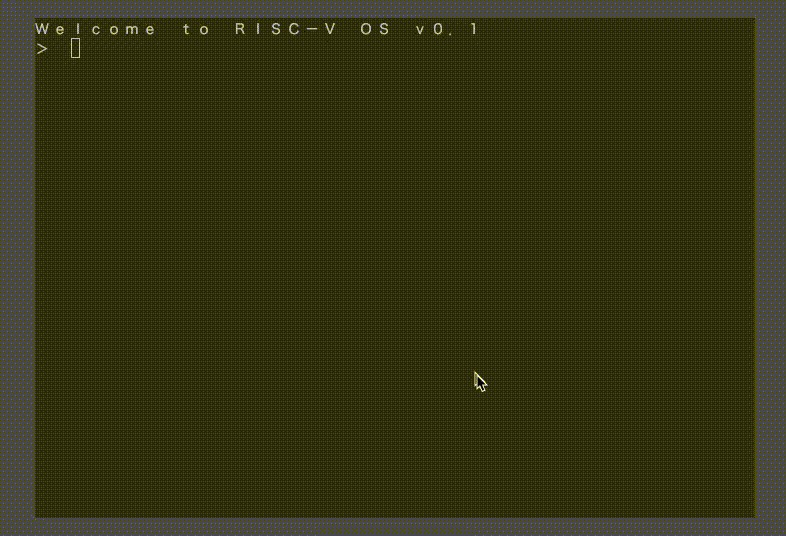

# riscv-os

RISCV-OS is a tiny OS for the 32-bit RISC-V platform, implemented entirely in
assembly (although applications for the system can be written in other languages -
currently Assembly, C and Rust).

The OS runs on the [virt](https://www.qemu.org/docs/master/system/riscv/virt.html)
and [SiFive](https://www.qemu.org/docs/master/system/riscv/sifive_u.html) machines
under QEMU, with a minimalistic hardware configuration (4MB of RAM, a single core).
It is equally minimal about the instruction set: it needs only the E, M and Zicsr
extensions, and provides software fallbacks when M is missing.

## Features



The OS has reached the MVP state: it is complete enough to load and run external
programs. Conceptually it is closer to C64's
[Kernal](https://en.wikipedia.org/wiki/KERNAL) than to Linux or any RTOS -
a single program runs at a time, on top of a small set of system services.

### Implemented features

- text framebuffer (80x25 or 40x25 characters, depending on the platform),
  rendered on the terminal
- trivial shell
- UART, RTC and PLIC drivers behind a hardware abstraction layer (HAL)
- interrupt-driven keyboard input
- [system functions](docs/api.md) callable via `ecall`
- interrupt and exception handlers
- User Mode for the shell and programs, Machine Mode for the system, memory
  protected with PMP
- standard library: strings, 32/64-bit math, screen, time and file functions
- trivial, read-only file system (TAR-based)
- external programs (in Assembly, C and Rust), loadable from a disc image
- Unicode support (including wide characters and emoji)

### Planned features

- system events
- dynamic memory / heap
- running on physical devices (Raspberry Pi Pico 2 - in progress, see
  [#114](https://github.com/ddrcode/riscv-os/issues/114))

## Building and dependencies

[Nix](https://nixos.org/download/#download-nix) provides all the dependencies
(the exact nixpkgs revision is pinned in `nixpkgs.nix`). Enter the project folder
and type `nix-shell`, or - if you use
[nix direnv](https://github.com/nix-community/nix-direnv) - `direnv allow`.
Without nix, install RISC-V binutils/gcc and QEMU manually; the Rust programs
additionally need rustup (the toolchain itself is pinned in
`apps/rust-toolchain.toml`).

For the full experience, build the applications disc and start the system with it:

```bash
cd apps
make disc
cd ..
make run DRIVE=apps/disc.tar
```

The most important Makefile targets:

- `make run` - runs the system in QEMU
- `make test` - builds and runs all the tests in QEMU
- `make run TEST_NAME=math64` - runs a single test, with the output on the console
- `make debug TEST_NAME=math64` - starts a test in QEMU and waits for GDB
- `make gdb TEST_NAME=math64` - connects GDB to QEMU
- `make release` - optimized, stripped binary

Every target accepts a `MACHINE` parameter, e.g. `make run MACHINE=sifive_u`.
The available machines are `virt` (default), `sifive_u` and `sifive_e`
(no disc support on the last one).

### Output options

The `OUTPUT_DEV` option selects where the system output goes,
e.g. `make run OUTPUT_DEV=3`:

- `1` - framebuffer only (can be inspected with GDB)
- `2` - serial console only
- `3` - framebuffer and serial console; in this mode the framebuffer content
  can be dumped to the console with the `fbdump` program
- `5` - the framebuffer is rendered on the terminal with escape codes (default)

## Documentation

See [docs](docs/README.md): [architecture](docs/architecture.md),
[building and running](docs/building.md), [API reference](docs/api.md),
[development guide](docs/development.md), [hardware support](docs/hardware.md).

## Credits

The initial setup and linker file were inspired by the
[chuckb/riscv-helloworld](https://github.com/chuckb/riscv-helloworld) project.

## References

This is a learning project, and these sources helped me the most:

- [Project F - FPGA & RISC-V Tutorials](https://projectf.io/posts/) -
  great, deep posts by Will Green on RISC-V assembly programming, including a
  [cheat sheet](https://projectf.io/posts/riscv-cheat-sheet/) that I use frequently
- [An Introduction to Assembly Programming with RISC-V](https://riscv-programming.org/book/riscv-book.html) -
  a very helpful free book by Prof. Edson Borin
- [RISC-V from scratch](https://twilco.github.io/riscv-from-scratch/2019/04/27/riscv-from-scratch-2.html) -
  Tyler Wilcock's detailed posts on hardware layouts, linker scripts and more
- [Using as - the GNU Assembler](http://microelectronics.esa.int/erc32/doc/as.pdf) -
  a book by Dean Elsner, Jay Fenlason & friends
- [RISC Assembler Reference](https://michaeljclark.github.io/asm.html) -
  a handy list of assembler directives by Michael Clark
- [Generic Virtual Platform (virt)](https://www.qemu.org/docs/master/system/riscv/virt.html) -
  documentation of QEMU's virt platform
- [RISC-V Options (for gcc)](https://gcc.gnu.org/onlinedocs/gcc/RISC-V-Options.html) -
  compilation options, with a clear description of the RISC-V extensions
